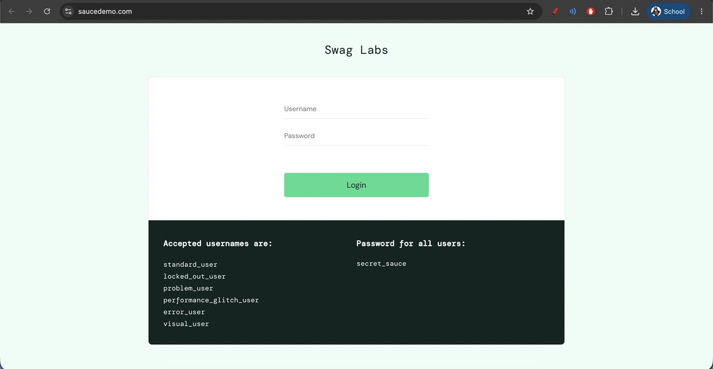

# Hi there, I'm José! 
## Junior QA Automation Engineer | Playwright | CI/CD | Open to opportunities
## Portfolio ->  https://github-qa.vercel.app/

<p align="center">
  
</p>

<p align="center">
  
</p>

# 🎭 Playwright SauceDemo E2E Test Suite

[](https://playwright.dev/)
[](https://www.typescriptlang.org/)
[](https://bun.sh/)
[](https://nodejs.org/)

A robust, enterprise-grade End-to-End (E2E) Test Automation Framework designed for the [SauceDemo](https://www.saucedemo.com) e-commerce platform. This project showcases modern QA engineering practices, implementing the **Page Object Model (POM)** design pattern, strict **TypeScript** typings, and CI/CD-ready configurations to deliver reliable, scalable, and ultra-fast test suites.

<p align="center">
  
  
</p>

---

## 🚀 Key Features

- **Page Object Model (POM) Design Pattern:** Clean separation of concerns. Page-specific locators and interactions are isolated in dedicated classes, decoupled from the test assertions.
- **Strict Type-Safety:** Fully written in TypeScript to catch errors at compile time, enable full IDE autocompletion, and enforce clean coding standards.
- **Resilient Locating Strategies:** Standardized locator definitions using stable QA attributes (`data-test` selectors), avoiding fragile CSS path or XPath structures that break on styling changes.
- **High-Performance Parallel Execution:** Pre-configured for fully parallel test execution (`fullyParallel: true`) using Playwright's multi-threaded worker architecture to drastically reduce test runtimes.
- **Fail-Safe Diagnostics & Flake Management:**
  - Automated HTML execution reports.
  - Fail-safe attachments: Screen captures and video recordings saved **only on failure** to optimize storage and debugging overhead.
  - Native Trace Viewer integration (`trace-on-first-retry`) for granular step-by-step failure inspections.

---

## 📁 Architecture & Project Structure

```text
playwright-saucedemo/
├── pages/                  # Page Object Classes encapsulating elements and actions
│   ├── LoginPage.ts        # Handles authentication actions and locators
│   ├── InventoryPage.ts    # Manages product sorting, filtering, and add-to-cart flows
│   ├── CartPage.ts         # Handles verification of items in cart and checkout trigger
│   └── CheckoutPage.ts     # Manages billing, shipping info input, and confirmation
├── tests/                  # Test Suites defining end-to-end scenarios
│   └── purchase.spec.ts    # Complete E2E user purchase journey
├── playwright.config.ts    # Global test configuration (browsers, workers, reporting)
├── bun.lock & package.json # Dependency manifests & scripts
└── README.md               # Framework documentation
```

---

## 🛠️ Tech Stack

- **Automation Engine:** Playwright Test v1.44.0+
- **Language:** TypeScript v5.4.5+
- **Runtimes Supported:** Node.js, Bun (highly optimized execution)
- **Reporting:** Playwright HTML Reporter

---

## ⚙️ Getting Started & Installation

### Prerequisites

Ensure you have **Node.js** (v18+) or **Bun** installed on your system.

### 1. Clone the Repository & Install Dependencies

```bash
# Clone the repository
git clone https://github.com/Michideveloper/playwright-saucedemo.git
cd playwright-saucedemo

# Option A: Using npm
npm install

# Option B: Using Bun (Recommended for fast installations)
bun install
```

### 2. Install Playwright Browsers

```bash
# Install the required browser binaries
npx playwright install chromium
```

---

## 🧪 Execution Commands

The framework offers multiple run configurations designed for local development and CI/CD pipelines:

| Command (npm) | Command (Bun) | Description |
|---|---|---|
| `npm run test` | `bun run test` | Runs all tests in **headless** mode (standard for CI pipelines). |
| `npm run test:headed` | `bun run test:headed` | Runs tests in **headed** mode (with browser window visible). |
| `npm run test:ui` | `bun run test:ui` | Launches the interactive **Playwright UI Runner** for visual debugging. |

### Visualizing HTML Reports

If a test fails or you want to view a detailed execution log, run:

```bash
npm run test:report
# or
bun run test:report
```

---

## 💡 Automation Best Practices Applied

1. **DRY (Don't Repeat Yourself) Principle:** Avoids duplicated locator declarations and interaction methods across tests.
2. **Smart Automatic Waiting:** Relies on Playwright's built-in auto-waiting and assertion retries instead of flaky, hardcoded wait timers (`page.waitForTimeout`), eliminating test instability.
3. **Flake Reduction & Retries:** Programmatically configured to auto-retry failed execution sequences when run inside CI environments.
4. **Rich Debugging Assets:** Complete traces, step-by-step videos, and screenshots captured dynamically on execution failure.

---

## 👨‍💻 Author

**José Gómez**  
QA Automation Engineer / Software Developer

- **GitHub:** [@Michideveloper](https://github.com/Michideveloper)
- **LinkedIn:** [devjosegomez](https://www.linkedin.com/in/devjosegomez/)
